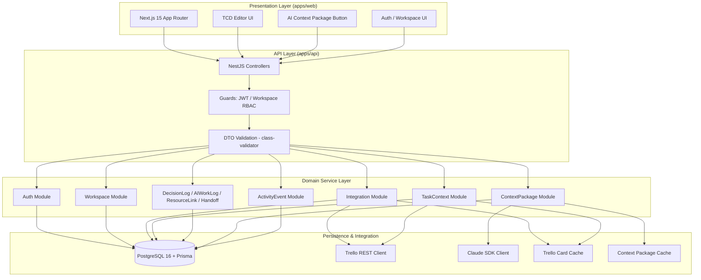
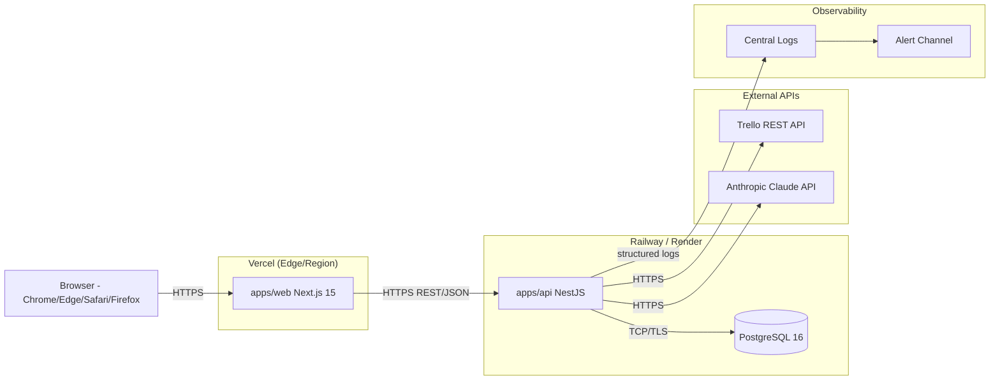
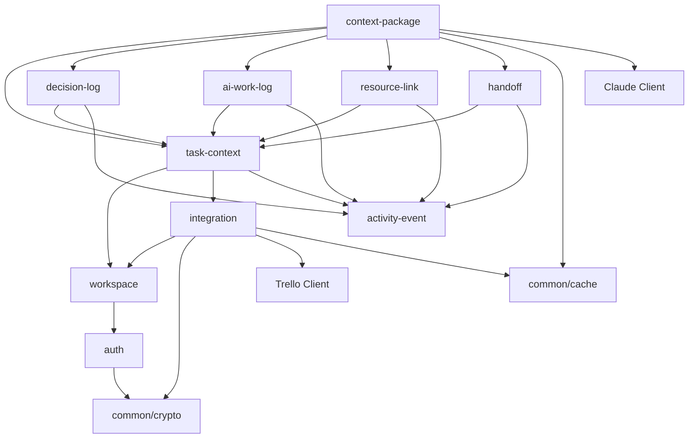
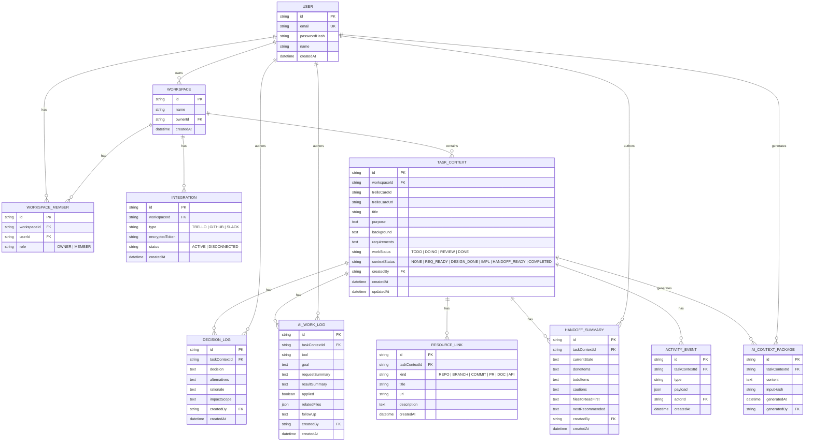
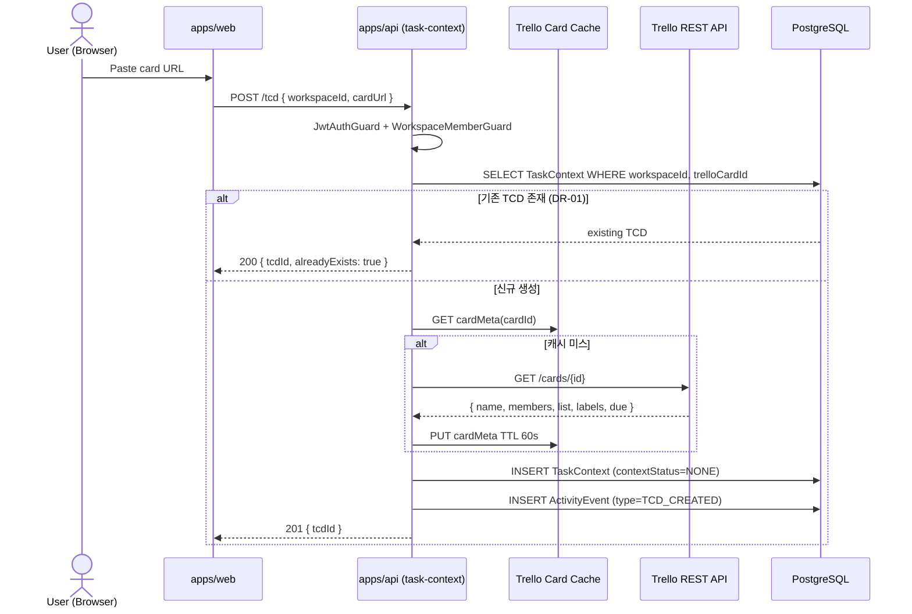
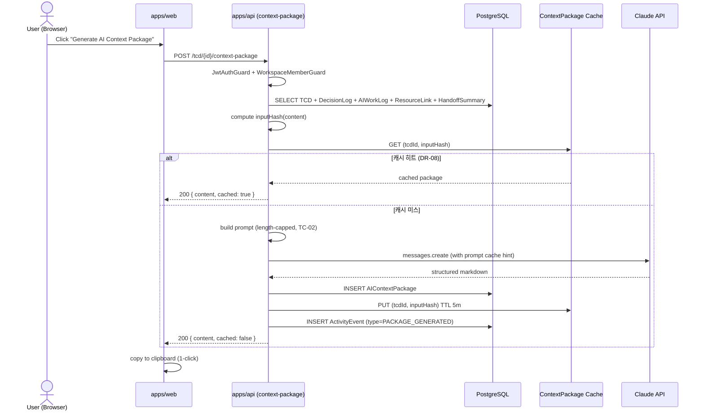

# Architecture — task-context-hub

> Trello 카드 1:1로 연결되는 Task Context Document(TCD)와 AI Context Package 생성을 핵심으로 하는 컨텍스트 레이어 도구의 아키텍처 설계 문서.

본 문서는 [`project-context.md`](./project-context.md)와 [`PRD.md`](./PRD.md)를 입력으로 작성되었으며, 두 문서가 정의한 도메인/요구사항/제약을 시스템 설계로 변환한다. PRD/project-context.md가 변경되면 본 문서도 동기화한다.

---

## 1. System Overview

### 1.1 시스템 정의

task-context-hub은 **Trello 카드 단위의 작업 컨텍스트(TCD)** 를 누적·재사용하는 컨텍스트 레이어 시스템이다. 시스템은 다음 세 가지 핵심 가치 흐름을 지원한다.

1. **컨텍스트 누적(Capture)**: Trello 카드 메타데이터 인입 → TCD 자동 생성 → Decision Log / AI Work Log / ResourceLink / Handoff Summary 누적
2. **컨텍스트 이식(Transfer)**: TCD → AI Context Package 단일 마크다운 생성 → 클립보드 복사로 외부 AI 도구에 이식
3. **컨텍스트 인수인계(Handoff)**: Handoff Summary + TCD 본문을 읽고 다른 개발자 또는 동일 개발자의 미래 세션이 작업을 이어감

### 1.2 시스템 범위

| 구분 | 포함 |
| --- | --- |
| **In-scope (MVP)** | Auth(이메일+JWT), Workspace/Member, Trello Integration, TaskContext, DecisionLog, AIWorkLog, ResourceLink, HandoffSummary, ActivityEvent, AIContextPackage 생성/캐시 |
| **Out-of-scope (MVP)** | GitHub/Slack 자동 연동(Phase 2), 임베딩 기반 유사작업 추천(Phase 3), AI 도구 직접 API 통합(후순위), 네이티브 모바일 앱 |

### 1.3 아키텍처 목표 (Architecture Drivers)

- **A1. 단일 호출 컨텍스트 이식**: AI Context Package는 1회 클릭으로 생성/복사 가능해야 한다 (PRD §3.1, FR-13).
- **A2. 워크스페이스 격리**: 모든 도메인 객체는 워크스페이스에 귀속되며, 다른 워크스페이스에서 절대 접근 불가 (DR-03, NFR-14).
- **A3. 외부 토큰 안전**: Trello/Claude/외부 토큰은 평문 저장/로그 노출이 0건이어야 한다 (TC-03, NFR-06).
- **A4. 외부 API 비용/Rate Limit 통제**: Trello rate limit과 Claude 토큰 비용을 캐싱/백오프로 제어 (TC-01, TC-02, NFR-12, NFR-13).
- **A5. 사람·AI 공동 파싱 가능 구조**: TCD 본문은 고정된 `## Level 2` 헤더 구조 (TC-07).
- **A6. 독립 배포 가능 모노레포**: `apps/web`과 `apps/api`가 Turborepo 안에서 독립 빌드/배포 (TC-08, TC-09).

---

## 2. High-Level Architecture

### 2.1 계층 구조 (Layered View)

시스템은 **프레젠테이션 → API → 도메인 서비스 → 영속성/외부 통합**의 4계층 구조를 따른다. 각 계층은 자신보다 하위 계층에만 의존한다.



### 2.2 배포 아키텍처 (Deployment View)

MVP는 단일 web/단일 api 인스턴스로 시작한다 (TC-10). 추후 트래픽 증가 시 web/api 분리 및 무거운 통합 동기화는 별도 워커/큐로 분리한다.



---

## 3. Component Design

### 3.1 Frontend (`apps/web`) 모듈 구조

| 모듈 | 책임 | 주요 의존 |
| --- | --- | --- |
| `app/(auth)` | 회원가입/로그인 페이지 (App Router) | API Client(Auth) |
| `app/(workspace)` | 워크스페이스 생성/멤버 관리 화면 | API Client(Workspace) |
| `app/(workspace)/[wsId]/tasks` | TCD 목록·검색·필터 (FR-16) | API Client(TaskContext) |
| `app/(workspace)/[wsId]/tasks/[tcdId]` | TCD 상세: Context Page, Logs, Links, Handoff | API Client(전체 도메인) |
| `components/tcd-editor` | TCD 본문 마크다운 편집/미리보기 (FR-09, TC-07) | shadcn/ui, markdown 렌더러 |
| `components/context-package-button` | AI Context Package 1-클릭 생성/복사 (FR-13) | clipboard, API Client(ContextPackage) |
| `components/handoff-card` | 최신 Handoff Summary 메인 카드 (FR-15) | API Client(Handoff) |
| `lib/api` | API Client (fetch wrapper, JWT 부착, 401 핸들링) | - |
| `lib/auth` | 클라이언트 세션/토큰 보관 | - |

### 3.2 Backend (`apps/api`) 모듈 구조

| 모듈 | 책임 (도메인 규칙) | 의존 |
| --- | --- | --- |
| `auth` | 회원가입(bcrypt), 로그인, JWT 발급/검증, 5회 실패 후 15분 잠금 (FR-01..03, NFR-07) | `common/crypto`, Prisma |
| `workspace` | 워크스페이스 생성, 멤버 초대/제거, RBAC OWNER/MEMBER (FR-04, FR-17) | Prisma |
| `integration` | Trello 토큰 등록/검증/해제, 암호화 저장/복호화 (FR-05, TC-03) | `common/crypto`, Trello Client |
| `task-context` | TCD CRUD, 카드 1:1 보장(DR-01), 컨텍스트 상태 (FR-07..09, FR-14) | `integration`, `activity-event` |
| `decision-log` | Decision Log CRUD, 4필드 필수 (FR-10, DR-04) | `activity-event` |
| `ai-work-log` | AI Work Log CRUD, 5필드 필수, 4000자 제한 (FR-11, DR-05, TC-06) | `activity-event` |
| `resource-link` | ResourceLink 등록/조회, URL 스킴 검증 (FR-12) | `activity-event` |
| `handoff` | Handoff Summary CRUD, 최신 1건 메인카드 (FR-15, DR-06) | `activity-event` |
| `context-package` | AI Context Package 생성, Claude 호출, 결과 캐시, 캐시 무효화 (FR-13, DR-08, NFR-02, TC-02) | Claude Client, Cache, 전 도메인 read |
| `activity-event` | 모든 변경 이벤트 적재 (FR-15 reuse, DR-07, NFR-15) | Prisma |
| `common/guards` | `JwtAuthGuard`, `WorkspaceRoleGuard`, `WorkspaceMemberGuard` (FR-17, NFR-14) | `auth`, `workspace` |
| `common/crypto` | AES-GCM 토큰 암호화, bcrypt 래퍼 (TC-03, TC-04) | env-key / KMS |
| `common/cache` | TTL 캐시 (Trello card meta, Context Package) (TC-01, TC-02) | in-process LRU (MVP) |
| `common/exceptions` | 표준 에러 매핑(401/403/404/422), 5xx 알림 (NFR-11) | logger |

### 3.3 모듈 의존성

도메인 모듈은 단방향으로만 의존하며, `context-package`는 다수 모듈을 **읽기 전용**으로 조회한다. `activity-event`는 횡단(cross-cutting) 모듈이다.



---

## 4. Data Architecture

### 4.1 ERD



### 4.2 테이블 상세 / 제약

| 테이블 | 핵심 제약 / Unique | 비고 |
| --- | --- | --- |
| `User` | `UNIQUE(email)` | `passwordHash`는 bcrypt 결과 (TC-04, NFR-07) |
| `Workspace` | FK `ownerId → User.id` | OWNER 멤버는 멤버 테이블에도 row 보유 |
| `WorkspaceMember` | `UNIQUE(workspaceId, userId)` | role enum |
| `Integration` | `UNIQUE(workspaceId, type) WHERE status='ACTIVE'` | `encryptedToken`은 AES-GCM 결과 (TC-03) |
| `TaskContext` | `UNIQUE(workspaceId, trelloCardId)` | DR-01 카드↔TCD 1:1 보장 |
| `DecisionLog` | NOT NULL: decision/alternatives/rationale/impactScope | DR-04 |
| `AIWorkLog` | NOT NULL: tool/goal/requestSummary/resultSummary/applied; requestSummary/resultSummary ≤ 4000자 | DR-05 |
| `ResourceLink` | URL 스킴 `http(s)://` 검증 | FR-12 |
| `HandoffSummary` | 최신 1건이 "메인", 과거본은 이력 | DR-06 |
| `ActivityEvent` | type enum, payload JSON | DR-07 |
| `AIContextPackage` | `inputHash`는 TCD+자식 도메인 컨텐츠 해시 | DR-08 캐시 무효화 키 |

### 4.3 인덱스 전략

| 인덱스 | 목적 | 관련 요구 |
| --- | --- | --- |
| `Workspace(ownerId)` | 사용자별 워크스페이스 조회 | FR-04 |
| `WorkspaceMember(userId)` | 사용자 소속 워크스페이스 목록 | FR-17 |
| `WorkspaceMember(workspaceId)` | 멤버 조회 | FR-04 |
| `TaskContext(workspaceId, contextStatus)` | 컨텍스트 상태별 필터링 | FR-14, FR-16 |
| `TaskContext(workspaceId, workStatus)` | 작업 상태 필터링 | FR-16 |
| `TaskContext(workspaceId, title)` (GIN trigram 또는 LIKE 인덱스) | 제목 부분 일치 검색 ≤ 2초 | FR-16 |
| `TaskContext(workspaceId, trelloCardId)` UNIQUE | 카드 중복 생성 방지 | DR-01 |
| `DecisionLog(taskContextId, createdAt DESC)` | 시간순 역정렬 | FR-10 |
| `AIWorkLog(taskContextId, createdAt DESC)` | 시간순 역정렬 | FR-11 |
| `HandoffSummary(taskContextId, createdAt DESC)` | 최신 1건 메인 카드 | FR-15 |
| `ActivityEvent(taskContextId, createdAt DESC)` | 이력 조회 | NFR-15 |
| `AIContextPackage(taskContextId, inputHash)` | 캐시 lookup | DR-08, FR-13 |

### 4.4 데이터 흐름 (Sequence)

#### 4.4.1 Trello 카드 → TCD 자동 생성



#### 4.4.2 AI Context Package 생성



---

## 5. API Design

### 5.1 공통 규약

- **Base path**: `/api/v1`
- **인증**: `Authorization: Bearer <JWT>` (FR-02, NFR-05)
- **컨텐츠 타입**: `application/json; charset=utf-8`
- **에러 응답**:
  ```json
  { "error": { "code": "FORBIDDEN", "message": "..." } }
  ```
- **표준 코드**: 200 / 201 / 204 / 400(검증) / 401(미인증) / 403(권한) / 404 / 409(중복) / 422(도메인 규칙) / 429(rate limit) / 5xx
- **로그 마스킹**: `Authorization` / `passwordHash` / `encryptedToken` / 외부 토큰 평문은 응답·로그에 절대 포함 금지 (TC-05, NFR-05/06).

### 5.2 엔드포인트 목록

| 메서드 | 경로 | 책임 | 관련 FR |
| --- | --- | --- | --- |
| POST | `/auth/signup` | 회원가입 | FR-01 |
| POST | `/auth/login` | 로그인, JWT 발급 | FR-02 |
| POST | `/auth/logout` | 토큰 무효화 | FR-03 |
| POST | `/workspaces` | 워크스페이스 생성 (OWNER) | FR-04 |
| GET | `/workspaces` | 본인 소속 워크스페이스 목록 | FR-04, FR-17 |
| POST | `/workspaces/{wsId}/members` | 멤버 추가(OWNER) | FR-04 |
| DELETE | `/workspaces/{wsId}/members/{memberId}` | 멤버 제거(OWNER) | FR-04 |
| POST | `/workspaces/{wsId}/integrations/trello` | Trello 토큰 등록·검증 | FR-05 |
| DELETE | `/workspaces/{wsId}/integrations/trello` | 연결 해제 | FR-05 |
| GET | `/workspaces/{wsId}/integrations/trello/boards` | 보드 목록 (≤5s) | FR-06 |
| POST | `/workspaces/{wsId}/tcd` | 카드 URL/ID → TCD 자동 생성 | FR-07, FR-08 |
| GET | `/workspaces/{wsId}/tcd` | TCD 목록·검색·필터 | FR-16 |
| GET | `/tcd/{tcdId}` | TCD 상세 | FR-09 |
| PATCH | `/tcd/{tcdId}` | 본문/컨텍스트 상태 수정 | FR-09, FR-14 |
| POST | `/tcd/{tcdId}/decisions` | Decision Log 추가 | FR-10 |
| GET | `/tcd/{tcdId}/decisions` | Decision Log 목록(시간 역순) | FR-10 |
| POST | `/tcd/{tcdId}/ai-logs` | AI Work Log 추가 | FR-11 |
| GET | `/tcd/{tcdId}/ai-logs` | AI Work Log 목록 | FR-11 |
| POST | `/tcd/{tcdId}/links` | ResourceLink 추가 | FR-12 |
| GET | `/tcd/{tcdId}/links` | ResourceLink 목록(종류별 그룹) | FR-12 |
| POST | `/tcd/{tcdId}/handoffs` | Handoff Summary 추가 | FR-15 |
| GET | `/tcd/{tcdId}/handoffs` | Handoff 이력 + 최신 | FR-15 |
| POST | `/tcd/{tcdId}/context-package` | AI Context Package 생성/캐시 | FR-13 |

### 5.3 요청/응답 예시

**회원가입 (FR-01)**

```http
POST /api/v1/auth/signup
Content-Type: application/json

{ "email": "alice@example.com", "password": "correct-horse-battery-staple", "name": "Alice" }
```
```json
HTTP/1.1 201 Created
{ "userId": "usr_01HX...", "token": "<JWT>", "expiresAt": "2026-06-13T07:00:00Z" }
```

**Trello 카드 → TCD 자동 생성 (FR-07/08)**

```http
POST /api/v1/workspaces/ws_01HX.../tcd
Authorization: Bearer <JWT>
Content-Type: application/json

{ "cardUrl": "https://trello.com/c/abc123/42-fix-login" }
```
```json
HTTP/1.1 201 Created
{
  "tcdId": "tcd_01HX...",
  "title": "Fix login",
  "trelloCardId": "abc123",
  "contextStatus": "NONE",
  "workStatus": "DOING",
  "createdAt": "2026-06-12T10:00:00Z"
}
```
- `409 Conflict`: 동일 카드 TCD 이미 존재 (DR-01)
- `424 Failed Dependency` 또는 `502 Bad Gateway`: Trello API 실패 + 재시도 가능 메시지 (FR-08)

**Decision Log 작성 (FR-10, DR-04)**

```http
POST /api/v1/tcd/tcd_01HX.../decisions
Authorization: Bearer <JWT>

{
  "decision": "JWT를 단기 access + refresh 구조로 변경",
  "alternatives": "세션 쿠키 / OAuth2 위임",
  "rationale": "SPA 구조와 멀티 클라이언트 확장에 적합",
  "impactScope": "auth 모듈, web 토큰 보관 정책"
}
```
- 4개 필드 중 하나라도 누락 시 `422 Unprocessable Entity`.

**AI Context Package 생성 (FR-13)**

```http
POST /api/v1/tcd/tcd_01HX.../context-package
Authorization: Bearer <JWT>
```
```json
HTTP/1.1 200 OK
{
  "content": "# Task Context Package\n\n## 작업명\n...\n## 다음 요청\n...",
  "cached": false,
  "generatedAt": "2026-06-12T10:05:00Z"
}
```
- p95 ≤ 10s (NFR-02, SC-06). 동일 입력 5분 이내 재요청 시 `cached: true`.

---

## 6. Integration Design

### 6.1 Trello REST API

| 항목 | 설계 |
| --- | --- |
| 용도 | 카드 메타데이터(제목/담당자/상태/라벨/마감일) 조회 (FR-06, FR-08) |
| 인증 | API Key + Token (또는 OAuth) — `Integration.encryptedToken`을 복호화하여 사용 |
| 호출 위치 | `integration` 모듈 내부 `TrelloClient`. 다른 모듈은 직접 호출 금지 |
| 캐싱 | 카드 메타데이터 in-process LRU 캐시, TTL 60s. 동일 워크스페이스 내 동일 카드 반복 호출 차단 (TC-01) |
| Rate limit 대응 | 응답 429 시 지수 백오프(1s → 2s → 4s, 최대 3회) 후 사용자에게 재시도 가능 오류 (NFR-13) |
| 에러 분류 | 4xx(권한/토큰) → 통합 상태 `DISCONNECTED` 마킹 검토 / 5xx → 일시 오류 표시 |
| 평문 노출 방지 | 토큰은 응답/로그/예외 메시지에 절대 포함하지 않음 (NFR-06, TC-05) |

### 6.2 Anthropic Claude API

| 항목 | 설계 |
| --- | --- |
| 용도 | AI Context Package 생성 (FR-13) |
| SDK | `@anthropic-ai/sdk` (Node) |
| 호출 위치 | `context-package` 모듈 내부 `ClaudeClient` |
| 모델 | 최신 Claude 모델 (운영 시점 결정), Opus/Sonnet/Haiku 중 비용·품질 균형 |
| 입력 통제 | 프롬프트는 길이 상한을 적용하여 토큰 폭주 방지 (TC-02) |
| 프롬프트 캐싱 | SDK의 prompt caching 기능을 사용하여 동일 베이스 프롬프트 재사용 (TC-02) |
| 결과 캐싱 | `(tcdId, inputHash)` 키로 5분 TTL 캐시 (DR-08, FR-13 AC) |
| 캐시 무효화 | TCD/DecisionLog/AIWorkLog/ResourceLink/HandoffSummary 변경 시 `inputHash` 변경으로 자동 무효화 |
| 에러 분류 | 429 → 지수 백오프 1회 후 사용자에게 재시도 안내 / 5xx → 일시 오류 |
| 비용 관리 | 월간 사용량 메트릭 + 예산 알림 (NFR-12). 호출당 입력 길이/총 토큰 메트릭 적재 |
| 시크릿 가드 | AI Work Log/입력 텍스트의 시크릿 패턴 감지 시 저장 단계에서 사용자 검수 (TC-06) |

### 6.3 에러/재시도 정책 (공통)

- **재시도 가능**: 네트워크 타임아웃, 429, 5xx → 지수 백오프(최대 3회)
- **재시도 금지**: 4xx 권한/검증 오류 → 사용자에게 사유 노출
- **타임아웃**: Trello 5s, Claude 25s
- **회로 차단(Future)**: Phase 2에서 외부 의존이 늘 때 도입

---

## 7. Security Architecture

### 7.1 인증 (Authentication)

- **방식**: 이메일 + 비밀번호 → JWT (Access Token).
- **비밀번호 저장**: bcrypt 단방향 해시 (NFR-07, TC-04). 평문/가역 저장 금지.
- **로그인 보호**: 5회 연속 실패 시 15분 잠금 (FR-02). 잠금 카운트는 DB 또는 캐시.
- **세션 만료**: Access Token에 `exp` 클레임 명시. 만료 후 호출은 401 (FR-03).
- **HTTPS 강제**: 모든 통신 구간 TLS. 토큰 평문이 로그/응답에 노출되지 않음 (NFR-05).
- **에러 메시지**: 잘못된 자격증명은 "이메일/비밀번호 확인" 같은 일반 오류만 반환(어느 쪽이 틀렸는지 노출 금지) (FR-02 AC).

### 7.2 인가 (Authorization) / RBAC

- **역할**: `OWNER`, `MEMBER` (워크스페이스 스코프).
- **가드 체인**:
  1. `JwtAuthGuard`: JWT 검증 + 만료 체크
  2. `WorkspaceMemberGuard`: 요청 경로의 `wsId`에 사용자가 멤버인지 검증
  3. `WorkspaceRoleGuard('OWNER')`: 멤버 추가/제거 등 OWNER 전용 액션
- **데이터 격리(DR-03, NFR-14)**:
  - 모든 도메인 조회 쿼리는 `workspaceId` 또는 상위 `TaskContext.workspaceId` 필터를 강제.
  - 응답에는 타 워크스페이스의 ID/메타데이터를 포함하지 않음.
  - 정기 권한 회귀 테스트로 누설 0건을 검증 (NFR-14).
- **편집 권한 (FR-10)**: 본인 작성 로그만 수정/삭제. 다른 사용자 로그 삭제는 OWNER만.

### 7.3 외부 토큰 암호화

- **알고리즘**: AES-256-GCM (애플리케이션 레벨).
- **키 관리**: 환경변수 또는 시크릿 매니저(KMS)에 마스터 키 보관. DB에 키를 함께 저장하지 않음 (TC-03).
- **저장 컬럼**: `Integration.encryptedToken`. 응답/직렬화에서 절대 노출하지 않음 (NFR-06).
- **로그 마스킹**: 통신 로그/예외 stack에 토큰 평문 포함 금지 (NFR-05, TC-05).

### 7.4 입력 검증

- **DTO 검증**: `class-validator` + `class-transformer`로 모든 요청 본문 검증 → 위반 시 400/422.
- **URL 검증**: `ResourceLink.url`은 `http://` 또는 `https://` 스킴만 허용 (FR-12).
- **길이 제한**: `AIWorkLog.requestSummary`/`resultSummary` ≤ 4000자 (FR-11).
- **마크다운 렌더 가드**: 클라이언트 렌더 시 sanitize(XSS 방지).

### 7.5 감사/관측 (NFR-11, NFR-15)

- 모든 변경(생성/수정/삭제)을 `ActivityEvent`에 적재 (DR-07).
- 모든 5xx 응답은 중앙 로그 + 알림 채널 발송.

---

## 8. Infrastructure Design

### 8.1 환경 분리

| 환경 | 구성 | 비고 |
| --- | --- | --- |
| **Local** | `docker-compose.yml`로 PostgreSQL 16 기동 + `pnpm dev` | 별도 설치 없이 부팅 (TC-11) |
| **Staging** | Vercel(Preview) + Railway/Render(API 별도 환경) | PR 단위 검증 |
| **Production** | Vercel(Production) + Railway/Render(API 운영) + 관리형 PostgreSQL 16 | 일 1회 백업 + 월 1회 복구 리허설 (NFR-04) |

### 8.2 빌드/배포

- **모노레포**: Turborepo + pnpm workspaces. `apps/web`, `apps/api`가 독립 빌드/캐시 (TC-09).
- **CI 파이프라인 (권장)**: lint → typecheck → unit/integration test → build → deploy(브랜치별 환경).
- **마이그레이션**: `apps/api/prisma/migrations`가 단일 출처 (TC-08). 배포 전 자동 적용.

### 8.3 스케일링 경로

- **MVP**: 단일 web/단일 api 인스턴스 (TC-10).
- **Phase 2 분리**:
  - web ↔ api 인스턴스 분리, 수평 확장.
  - 무거운 통합 동기화(Trello/GitHub 폴링, 배치)를 **별도 워커 + 큐**(BullMQ/Redis 등)로 분리.
- **DB**: read replica는 검색량 증가 시점에 고려.
- **캐시**: in-process LRU → 분산 캐시(Redis)로 전환 가능한 인터페이스 유지.

### 8.4 모니터링/관측성

| 항목 | 도구/방법 | 관련 NFR |
| --- | --- | --- |
| 가용성 | Uptime 모니터 + 월간 리포트 | NFR-03 |
| 응답 시간 p95 | API Gateway / APM 메트릭 | NFR-01, NFR-02 |
| 로그/알림 | 중앙 로그 시스템 + 5xx 알림 채널 | NFR-11 |
| Trello 호출 메트릭 | 429 비율, 백오프 카운트 | NFR-13 |
| Claude 비용 | 토큰 사용량 + 월간 예산 알림 | NFR-12 |
| 권한 회귀 | 통합 테스트 + 정기 권한 점검 | NFR-14 |
| 변경 이력 적재율 | ActivityEvent 적재 비율 | NFR-15 |

### 8.5 백업/내구성 (NFR-04)

- PostgreSQL 일 1회 자동 백업 + 보존 기간 정의.
- 월 1회 복구 리허설로 백업 유효성 확인.

---

## 9. Technical Decisions (ADR)

### ADR-001: 모노레포 + Next.js 15 / NestJS / PostgreSQL / Prisma 스택 채택

**상태:** 채택됨

**컨텍스트:**
- task-context-hub은 SSR이 가능한 데스크톱 우선 웹 UI (TC-12)와, 외부 연동·도메인 트랜잭션을 가진 백엔드가 모두 필요하다.
- `apps/web`(Next.js 15, App Router)과 `apps/api`(NestJS)를 단일 저장소에서 관리하면서, 빌드/배포는 독립적이어야 한다 (TC-09).
- 데이터 모델은 관계형 트랜잭션 일관성이 필요한 영역(워크스페이스/멤버/도메인 종속 관계)이 많다.

**결정:**
- Turborepo + pnpm workspaces로 모노레포 구성, `apps/web` + `apps/api` + `packages/*` 분리.
- 프론트엔드 Next.js 15 (App Router), 백엔드 NestJS, ORM Prisma, DB PostgreSQL 16.
- Prisma 스키마는 `apps/api/prisma/`를 단일 출처로 사용 (TC-08).

**결과:**
- (+) Next.js의 SSR/CSR/라우팅과 NestJS의 모듈/DI/가드 체계로 보안·구조 일관성 확보.
- (+) Prisma 단일 스키마로 도메인 진실의 출처가 흩어지지 않음.
- (+) Turborepo 캐시로 CI 시간 단축, 각 앱 독립 배포 가능.
- (−) 두 프레임워크/언어 도구 학습 곡선, 단일 풀스택 프레임워크 대비 보일러플레이트 증가.

### ADR-002: AI Context Package는 결과 캐시 + 프롬프트 캐싱으로 비용/지연 통제

**상태:** 채택됨

**컨텍스트:**
- AI Context Package 생성은 사용자가 자주 누르는 핵심 기능이며 (FR-13), p95 ≤ 10s 응답시간 (NFR-02, SC-06)과 Claude API 비용 통제 (NFR-12, TC-02) 둘 다를 만족해야 한다.
- 동일 TCD가 변경되지 않은 상태에서 5분 이내 재요청은 결과가 동일하므로 LLM을 다시 호출할 필요가 없다 (FR-13 AC).
- TCD/자식 도메인(DecisionLog/AIWorkLog/ResourceLink/HandoffSummary) 중 하나라도 변경되면 캐시는 무효화되어야 한다 (DR-08).

**결정:**
- `context-package` 모듈에 두 단계 캐시 전략을 적용한다.
  1. **결과 캐시**: 키 = `(tcdId, inputHash)`, TTL = 5분. `inputHash`는 TCD + 자식 도메인 컨텐츠를 정규화한 해시.
  2. **프롬프트 캐싱**: Anthropic SDK의 prompt caching을 사용해 베이스 프롬프트/구조 부분을 재사용.
- Claude 호출 전 프롬프트 길이 상한을 강제하여 토큰 폭주를 방지한다.
- 캐시 히트 시 응답에 `cached: true`를 명시한다.

**결과:**
- (+) p95 응답 시간 목표 (NFR-02) 달성 용이.
- (+) 동일 입력에 대한 비용 0, 변경 입력에 대한 비용 효율화 (NFR-12, TC-02).
- (+) 캐시 키가 컨텐츠 해시이므로 캐시 무효화가 명시적이고 안전 (DR-08).
- (−) `inputHash` 계산/일관성 유지 비용. 캐시 인터페이스를 MVP는 in-process로 두지만 Phase 2에서 Redis 전환이 필요.

### ADR-003: 외부 통합 토큰은 AES-GCM 애플리케이션 레벨 암호화로 저장

**상태:** 채택됨

**컨텍스트:**
- Trello/Claude/외부 토큰은 워크스페이스 단위로 저장되며, 평문 DB 저장은 절대 금지된다 (TC-03, NFR-06).
- DB 컬럼 암호화(투명 암호화)는 DB 침해 시에는 보호력이 약하다. 애플리케이션 레벨 암호화로 키와 DB를 분리해야 한다.
- 응답 본문/로그/예외에 토큰 평문이 포함되어서는 안 된다 (TC-05, NFR-05).

**결정:**
- 모든 외부 통합 토큰은 AES-256-GCM으로 애플리케이션 레벨에서 암호화하여 `Integration.encryptedToken`에 저장한다.
- 마스터 키는 환경변수 또는 시크릿 매니저(KMS)로 분리한다. DB와 같은 위치에 두지 않는다.
- 시리얼라이저/직렬화 단계에서 `encryptedToken` 필드는 응답에서 제거한다 (`@Exclude`).
- 로깅 인터셉터에서 토큰·자격증명 패턴을 마스킹한다.

**결과:**
- (+) DB 단독 침해 시에도 토큰이 즉시 노출되지 않음.
- (+) NFR-06, NFR-05, TC-03/05의 컴플라이언스 만족.
- (−) 키 분실 시 토큰 복호화 불가 → 키 백업/회전 정책이 운영 책임.
- (−) 정기 시크릿 스캔과 권한 회귀 테스트 운영 비용 발생 (NFR-06 운영 항목).

### ADR-004: TCD 본문은 고정 `## Level 2` 헤더 스키마로 사람·AI 공동 파싱

**상태:** 채택됨

**컨텍스트:**
- TCD는 사람이 읽기 좋아야 하면서, AI Context Package 생성 시 시스템이 섹션 단위로 안정적으로 파싱할 수 있어야 한다 (TC-07).
- 자유 형식 마크다운을 허용하면 AI Context Package 생성 시 프롬프트가 비결정적이 되고, 토큰/품질이 흔들린다 (FR-09 AC, FR-13).

**결정:**
- TCD 본문은 다음 `## Level 2` 섹션을 고정 헤더 텍스트로 사용한다: 작업 개요 / 목적 / 배경 / 요구사항 / 관련 도메인·모듈 / 관련 파일 / 진행 상태 / 남은 작업 / 이슈·주의사항.
- 자유 형식 본문은 위 섹션 **내부**에서만 허용한다.
- 에디터(`components/tcd-editor`)는 헤더 텍스트를 system-defined로 강제하고, 사용자는 본문만 작성한다.
- Context Package 생성기는 이 고정 스키마를 가정하고 프롬프트를 구성한다.

**결과:**
- (+) AI Context Package 생성 결과의 일관성/품질 향상.
- (+) Phase 2에서 Context Quality Score 도입 시 섹션별 충실도 자동 측정 가능.
- (−) 자유 형식 선호 사용자에게는 제약처럼 느껴질 수 있음 → 섹션 내부는 자유 형식으로 완화.

---

## 10. 품질 속성 매핑

### 10.1 FR → Component 매핑

| FR | 구현 컴포넌트 (Backend) | 구현 컴포넌트 (Frontend) | 관련 ADR |
| --- | --- | --- | --- |
| FR-01 회원가입 | `auth` (bcrypt) | `app/(auth)/signup` | ADR-001 |
| FR-02 로그인 | `auth` (JWT, 잠금) | `app/(auth)/login` | ADR-001 |
| FR-03 로그아웃/만료 | `auth` (token blacklist/exp) | `lib/auth` | ADR-001 |
| FR-04 워크스페이스/멤버 | `workspace`, `common/guards` | `app/(workspace)` | ADR-001 |
| FR-05 Trello 연동 등록 | `integration`, `common/crypto` | `app/(workspace)/[wsId]/settings` | ADR-003 |
| FR-06 Trello 보드 목록 | `integration` (Trello Client + cache) | `components/board-picker` | ADR-002 |
| FR-07 카드 URL/ID 입력 | `task-context` | `components/card-link-input` | ADR-001 |
| FR-08 TCD 자동 생성 | `task-context` + `integration` | `app/.../tasks` | ADR-001 |
| FR-09 Task Context Page 편집 | `task-context` | `components/tcd-editor` | ADR-004 |
| FR-10 Decision Log | `decision-log` | `components/decision-log-list` | ADR-001 |
| FR-11 AI Work Log | `ai-work-log` | `components/ai-work-log-list` | ADR-001 |
| FR-12 ResourceLink | `resource-link` | `components/links-panel` | ADR-001 |
| FR-13 AI Context Package | `context-package` (Claude + 캐시) | `components/context-package-button` | ADR-002, ADR-004 |
| FR-14 컨텍스트 상태 | `task-context` (contextStatus enum) | `components/status-switcher` | ADR-001 |
| FR-15 Handoff Summary | `handoff` | `components/handoff-card` | ADR-001 |
| FR-16 TCD 검색/목록 | `task-context` (인덱스 §4.3) | `app/.../tasks` | ADR-001 |
| FR-17 권한 가드 | `common/guards`, 모든 도메인 모듈 | `lib/api` (401/403 핸들링) | ADR-001 |

### 10.2 NFR → Architecture Decision 매핑

| NFR | 충족 설계 결정 | 측정 |
| --- | --- | --- |
| NFR-01 API p95 ≤ 500ms | §4.3 인덱스, §3.2 단일 책임 모듈, PostgreSQL + Prisma | API Gateway 메트릭 |
| NFR-02 Context Package p95 ≤ 10s | ADR-002 결과 캐시 + 프롬프트 캐싱 + 입력 길이 상한 | API p95 |
| NFR-03 가용성 ≥ 99.5% | §8.1 관리형 PaaS(Vercel/Railway) + 단일 인스턴스 → 분리 경로 | Uptime 리포트 |
| NFR-04 데이터 유실 0 | §8.5 일 1회 백업 + 월 1회 복구 리허설 | 복구 리허설 결과 |
| NFR-05 인증 토큰 평문 노출 0 | §7.1, §7.3 HTTPS 강제 + 로그 마스킹 | 로그·응답 점검 |
| NFR-06 외부 토큰 평문 저장 0 | ADR-003 AES-GCM 애플리케이션 암호화 | DB 컬럼 + 시크릿 스캔 |
| NFR-07 비밀번호 평문 0 | §7.1 bcrypt 단방향 해시 | 정기 코드/스키마 감사 |
| NFR-08 접근성 WCAG 2.1 AA | shadcn/ui 기본 + axe-core CI 점검 | axe-core 보고서 |
| NFR-09 브라우저 호환성 | Next.js 15 표준 + 크로스 브라우저 회귀 테스트 | 수동/자동 회귀 |
| NFR-10 반응형 1280px+ | §3.1 데스크톱 우선 레이아웃 | 반응형 테스트 |
| NFR-11 5xx 로그/알림 100% | §3.2 `common/exceptions` + §8.4 중앙 로그 + 알림 | 알림 채널 점검 |
| NFR-12 Claude 비용 통제 | ADR-002 + 입력 길이 상한 + 메트릭/예산 알림 | 월간 사용량 |
| NFR-13 Trello 429 < 1% | §6.1 카드 메타 캐시 + 지수 백오프 | 외부 호출 메트릭 |
| NFR-14 데이터 격리 0 누설 | §3.2 `WorkspaceMemberGuard` + §4.3 강제 `workspaceId` 필터 | 권한 회귀 테스트 |
| NFR-15 변경 이벤트 100% | §3.2 `activity-event` + 모든 도메인 모듈 emit | 적재 비율 점검 |

### 10.3 도메인 규칙(DR) → Architecture 매핑

| DR | 구현 위치 |
| --- | --- |
| DR-01 카드↔TCD 1:1 | §4.2 `UNIQUE(workspaceId, trelloCardId)` + §4.4.1 선조회 |
| DR-02 작업/컨텍스트 상태 분리 | §4.2 `workStatus` + `contextStatus` 컬럼 분리 |
| DR-03 워크스페이스 격리 | §7.2 가드 + §4.3 인덱스 + 강제 `workspaceId` 필터 |
| DR-04 Decision Log 필수 필드 | §4.2 NOT NULL + DTO `class-validator` |
| DR-05 AI Work Log 필수 필드 | §4.2 NOT NULL + 4000자 제한 |
| DR-06 Handoff 최신 1건 메인 | §4.3 `(taskContextId, createdAt DESC)` 인덱스 + 정렬 |
| DR-07 ActivityEvent 적재 | §3.2 모든 도메인 모듈 → `activity-event` emit |
| DR-08 Context Package 캐시 무효화 | ADR-002 `inputHash` 기반 키 |

### 10.4 기술 제약(TC) → Architecture 매핑

| TC | 구현 위치 |
| --- | --- |
| TC-01 Trello rate limit | §6.1 카드 메타 캐시 + 지수 백오프 |
| TC-02 Claude 비용 통제 | ADR-002 결과/프롬프트 캐싱 + 입력 길이 상한 |
| TC-03 외부 토큰 암호화 | ADR-003 AES-GCM + 시크릿 분리 |
| TC-04 비밀번호 단방향 해시 | §7.1 bcrypt |
| TC-05 토큰 평문 노출 금지 | §3.2 `common/exceptions` + 로그 마스킹 |
| TC-06 AI Work Log 시크릿 가드 | §6.2 시크릿 패턴 감지 + 사용자 검수 |
| TC-07 TCD 헤더 고정 | ADR-004 |
| TC-08 Prisma 단일 출처 | §8.2 `apps/api/prisma/` 단일 |
| TC-09 모노레포 독립 빌드 | §8.2 Turborepo + 각 앱 독립 배포 |
| TC-10 단일 서버 시작 | §8.3 MVP 단일 인스턴스, 워커 분리 경로 정의 |
| TC-11 로컬 docker-compose | §8.1 Local 환경 |
| TC-12 데스크톱 우선 | §3.1 layout + NFR-10 |
| TC-13 접근성 | NFR-08 axe-core |
| TC-14 브라우저 호환성 | NFR-09 회귀 테스트 |

---

## 변경 관리

- 본 문서는 [`PRD.md`](./PRD.md), [`project-context.md`](./project-context.md)와 동기화된 상태를 유지한다.
- FR/NFR 추가 또는 변경 시 §10 매핑 표를 함께 갱신한다.
- ADR 변경/대체 시 기존 ADR을 삭제하지 않고 상태를 "대체됨"으로 표시하고 후속 ADR을 추가한다.
