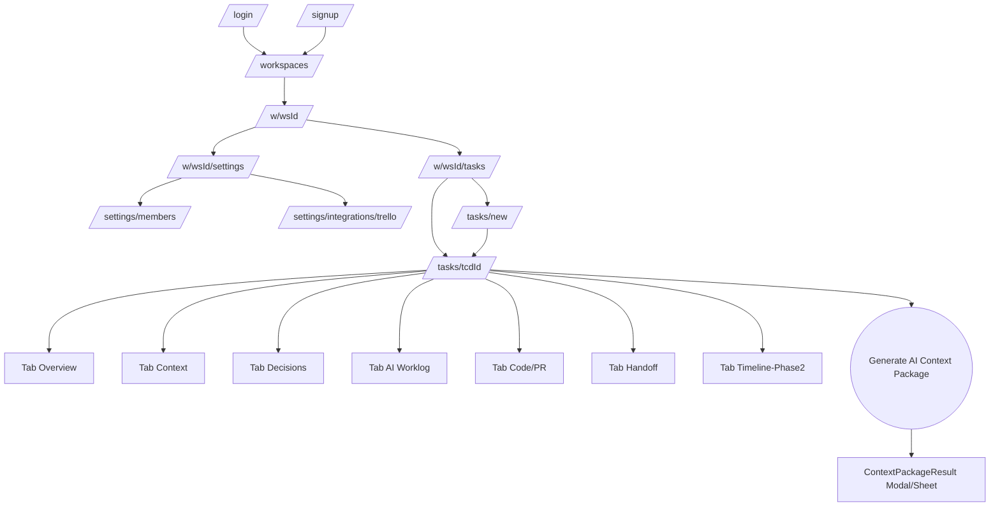
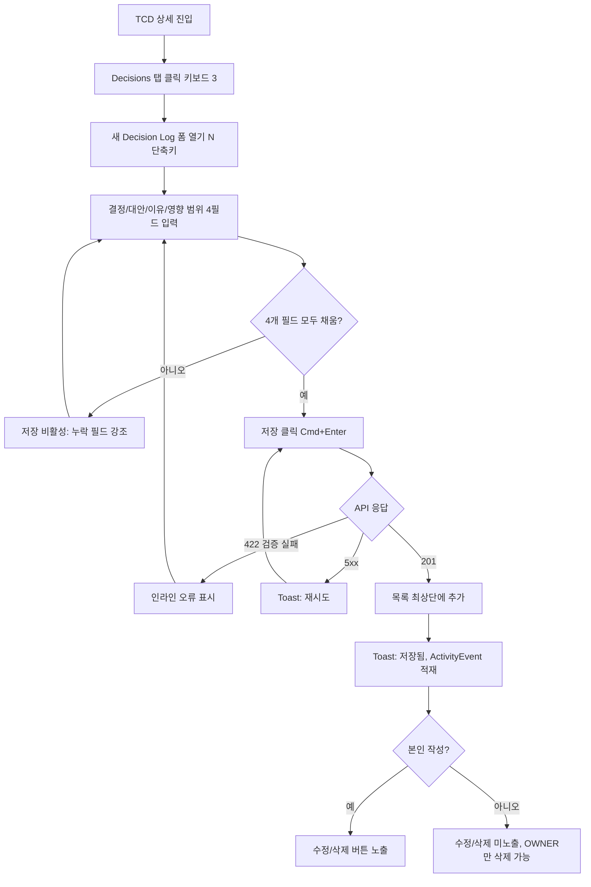
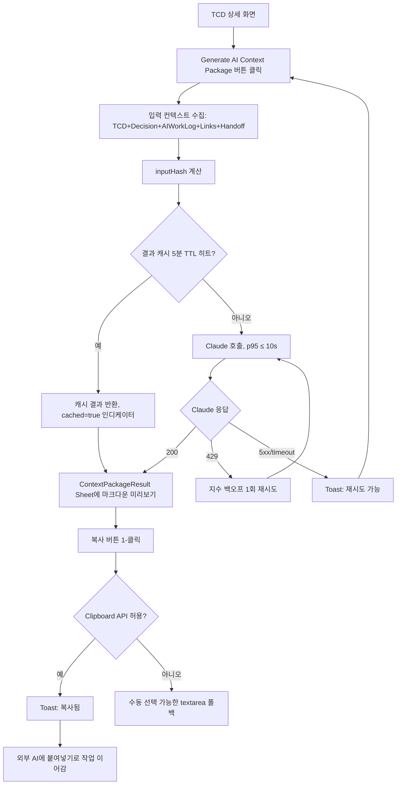
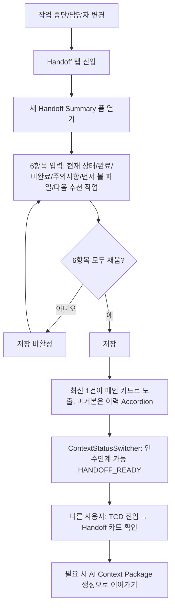

# UX Design Specification — task-context-hub

> Trello 카드 1:1로 연결되는 Task Context Document(TCD)와 AI Context Package 생성을 핵심으로 하는 컨텍스트 레이어 도구의 UX/디자인 스펙 문서.

본 문서는 [`PRD.md`](./PRD.md)의 User Journeys/FR과 [`Architecture.md`](./Architecture.md)의 Component Design/Frontend 구조를 입력으로 작성되었다. 두 문서가 정의한 요구사항과 컴포넌트 분리를 화면·인터랙션·디자인 토큰으로 변환한다. PRD/Architecture가 변경되면 본 문서도 동기화한다.

- **스타일 톤**: 전문적이고 신뢰감 있는, 정보 밀도 높은 개발자 도구 톤. 미니멀 모던.
- **디자인 시스템**: shadcn/ui (Radix UI 기반).
- **Primary 색상**: `#2563EB` (Blue 600).
- **참고 앱**: Linear(키보드 중심·빠른 개발자 도구 UX), Notion(구조화 문서 편집), Confluence(페이지 계층·task 중심 단순화). 참고만 하며 그대로 복제하지 않는다.
- **데스크톱 우선**: 너비 1280px 이상 기본. 모바일은 조회 위주 반응형.
- **접근성 기준**: WCAG 2.1 AA, axe-core 위반 0건 (NFR-08).

---

## 1. Design System Foundation

### 1.1 shadcn/ui 선택 근거

| 평가 항목 | 선택 이유 |
| --- | --- |
| Architecture 적합성 | Architecture §3.1 `components/*`가 `shadcn/ui` 기반이며, 모든 커스텀 컴포넌트의 기초 UI 단위로 가정됨. |
| 코드 소유권 | npm 패키지가 아니라 소스가 프로젝트로 복사되므로 컴포넌트 단위로 자유롭게 토큰/접근성/스타일을 수정 가능. |
| 접근성 | Radix UI Primitives 기반이므로 키보드 네비게이션·포커스 트랩·ARIA 속성이 기본 제공 → NFR-08(WCAG 2.1 AA) 달성 비용이 낮음. |
| 토큰 시스템 | Tailwind CSS 변수(HSL) 기반 토큰을 채택 → 본 문서의 색상/Spacing/Radius 토큰을 그대로 매핑 가능. |
| 다크 모드 | `class` 전략으로 라이트/다크 동시 운영 가능. MVP는 라이트 우선, 다크 모드는 토큰만 정의하고 Phase 2에 활성화. |
| 개발자 도구 톤 | 기본 컴포넌트가 미니멀 모던 톤이며 Linear/Notion 유사한 정보 밀도 높은 레이아웃에 적합. |

### 1.2 커스터마이징 원칙

- shadcn/ui 컴포넌트는 그대로 사용하지 않고, 본 문서 §2의 토큰과 §3의 상태 정의를 적용한 **프로젝트 빌트인 변형**으로만 사용한다.
- 커스터마이징은 다음 3단계로만 허용한다.
  1. **토큰 치환**: Tailwind CSS 변수(`--primary`, `--radius` 등)를 본 문서 §2 토큰으로 덮어쓴다.
  2. **변형(variant) 추가**: 신규 `variant` 또는 `size`만 추가하며, 기본 동작/접근성은 변경하지 않는다.
  3. **합성(composition)**: 신규 컴포넌트는 shadcn/ui의 기본 컴포넌트를 조합해 빌드한다(상속/포크 금지).
- shadcn/ui 컴포넌트의 Radix Primitive 동작(키보드 단축키, 포커스 관리, ARIA)을 우회/오버라이드하지 않는다.

### 1.3 아이콘 라이브러리

- **선택**: `lucide-react`. shadcn/ui 권장이며 24x24 기준 stroke 1.5 라인 아이콘 톤이 미니멀 모던 톤과 일치.
- **사용 규칙**:
  - 기본 크기: `16px` (Body inline), `20px` (Button/Input adornment), `24px` (Section header).
  - 컬러: `currentColor` 상속이 기본. 의미 컬러(success/warning/danger)에서만 의미 토큰 적용.
  - 단독 아이콘 버튼은 반드시 `aria-label` 또는 시각적으로 숨김 처리된 텍스트를 동반한다.
  - 동일 의미 액션은 동일 아이콘으로 통일한다(예: 복사 = `Copy`, 외부 링크 = `ExternalLink`).

---

## 2. Visual Foundation

본 절의 색상/Typography/Spacing/Radius/Shadow 토큰은 모두 프로젝트 단일 출처(`apps/web/styles/tokens.css` 등 구현 단계에서 확정)로 관리한다. HEX 값으로 명시한다.

### 2.1 Color Palette

**Primary (Blue)** — Primary 색상은 `#2563EB`. Tailwind `blue-600` 기준의 확장 스케일.

| 토큰 | HEX | 용도 |
| --- | --- | --- |
| `primary-50` | `#EFF6FF` | 가장 밝은 강조 배경(Toast 정보, Inline highlight) |
| `primary-100` | `#DBEAFE` | Hover 배경, Tag/Badge 배경 |
| `primary-200` | `#BFDBFE` | Selected 행 배경 |
| `primary-300` | `#93C5FD` | Disabled primary surface |
| `primary-400` | `#60A5FA` | 보조 강조 텍스트 |
| `primary-500` | `#3B82F6` | 보조 액션 hover |
| `primary-600` | `#2563EB` | **Primary 액션 / 링크 / Focus ring (기준)** |
| `primary-700` | `#1D4ED8` | Primary hover |
| `primary-800` | `#1E40AF` | Primary active/pressed |
| `primary-900` | `#1E3A8A` | 정보성 강조 텍스트(다크 배경 위) |

**Neutral (Gray) — Linear/Notion 톤의 정보 밀도 표현**

| 토큰 | HEX | 용도 |
| --- | --- | --- |
| `neutral-0` | `#FFFFFF` | 기본 표면(Card/Modal/Page 배경) |
| `neutral-50` | `#F8FAFC` | App background |
| `neutral-100` | `#F1F5F9` | Subtle background (Section header) |
| `neutral-200` | `#E2E8F0` | Border / Divider |
| `neutral-300` | `#CBD5E1` | Input border |
| `neutral-400` | `#94A3B8` | Placeholder / Muted icon |
| `neutral-500` | `#64748B` | Secondary text |
| `neutral-600` | `#475569` | Body text (보조) |
| `neutral-700` | `#334155` | Body text (기본) |
| `neutral-800` | `#1E293B` | Heading |
| `neutral-900` | `#0F172A` | High-emphasis text |

**Semantic 색상 — 대비 4.5:1 이상 보장(NFR-08, WCAG 2.1 AA)**

| 토큰 | HEX | 용도 |
| --- | --- | --- |
| `success-50` | `#ECFDF5` | Success 배경 |
| `success-500` | `#10B981` | Success 아이콘 |
| `success-700` | `#047857` | Success 텍스트(흰 배경 위) |
| `warning-50` | `#FFFBEB` | Warning 배경 |
| `warning-500` | `#F59E0B` | Warning 아이콘 |
| `warning-700` | `#B45309` | Warning 텍스트(흰 배경 위) |
| `danger-50` | `#FEF2F2` | Danger 배경 |
| `danger-500` | `#EF4444` | Danger 아이콘 |
| `danger-700` | `#B91C1C` | Danger 텍스트(흰 배경 위) |
| `info-50` | `#EFF6FF` | Info 배경 (primary 계열과 동일) |
| `info-700` | `#1D4ED8` | Info 텍스트 |

**컨텍스트 상태(Context Status) 색상** — FR-14의 6단계 컨텍스트 상태별 Badge 색상.

| 컨텍스트 상태 | 배경 | 텍스트 |
| --- | --- | --- |
| 미작성 (`NONE`) | `#F1F5F9` (neutral-100) | `#475569` (neutral-600) |
| 요구사항 정리됨 (`REQ_READY`) | `#EFF6FF` (info-50) | `#1D4ED8` (info-700) |
| 설계 확정됨 (`DESIGN_DONE`) | `#DBEAFE` (primary-100) | `#1E40AF` (primary-800) |
| 구현 진행 중 (`IMPL`) | `#FFFBEB` (warning-50) | `#B45309` (warning-700) |
| 인수인계 가능 (`HANDOFF_READY`) | `#ECFDF5` (success-50) | `#047857` (success-700) |
| 완료 요약됨 (`COMPLETED`) | `#F1F5F9` (neutral-100) | `#334155` (neutral-700) |

**대비 가이드** — 텍스트와 배경 대비는 본문 4.5:1, 14pt Bold/18pt 이상 3:1 이상 유지. 위 조합은 모두 4.5:1 이상.

### 2.2 Typography

- **글꼴**: 시스템 폰트 스택 우선 + 코드/카드 ID는 모노스페이스.
  - Sans: `Inter`, `-apple-system`, `BlinkMacSystemFont`, `Segoe UI`, `Roboto`, `Noto Sans KR`, sans-serif
  - Mono: `JetBrains Mono`, `Fira Code`, `SFMono-Regular`, `Menlo`, monospace
- **Type Scale** — `1rem = 16px` 기준.

| 토큰 | Size / Line | Weight | 용도 |
| --- | --- | --- | --- |
| `display` | 32 / 40 | 700 | 랜딩/온보딩 강조 헤드라인 |
| `heading-1` | 24 / 32 | 700 | 페이지 타이틀(Page header) |
| `heading-2` | 20 / 28 | 600 | 섹션 타이틀(TCD 본문 `##`) |
| `heading-3` | 18 / 26 | 600 | 카드/패널 타이틀 |
| `body-lg` | 16 / 24 | 400 | 강조 본문 |
| `body` | 14 / 22 | 400 | 기본 본문 |
| `body-sm` | 13 / 20 | 400 | Secondary text, 캡션 |
| `label` | 13 / 18 | 500 | 입력 레이블 |
| `caption` | 12 / 16 | 500 | 메타데이터(시각, 작성자) |
| `mono` | 13 / 20 | 500 | 카드 ID, URL, 코드 인라인 |

- **본문 최소 크기**: 13px(body-sm). 12px(caption)는 단독 정보 단위가 아닌 메타 정보로만 사용.
- **Heading 라인 높이**: `1.3` 전후, Body는 `1.5` 이상으로 가독성 확보.
- **Letter spacing**: Body 0, Heading -0.01em, Caption +0.02em(대문자/숫자 가독).
- **Truncation 규칙**: 카드 타이틀 1줄 말줄임(line-clamp-1), 설명/요약 2줄 말줄임(line-clamp-2).

### 2.3 Spacing

8px 그리드 기반(라벨/아이콘 보조용 4px 허용).

| 토큰 | px | 용도 |
| --- | --- | --- |
| `space-0` | 0 | 기본 reset |
| `space-1` | 4 | 아이콘-텍스트 갭, 칩 내부 |
| `space-2` | 8 | 인풋 내부 padding, 작은 갭 |
| `space-3` | 12 | 버튼 내부 horizontal, 카드 내부 갭 |
| `space-4` | 16 | 섹션 내부 padding |
| `space-5` | 20 | 카드 padding |
| `space-6` | 24 | 페이지 좌우 padding(데스크톱) |
| `space-8` | 32 | 섹션 간격 |
| `space-10` | 40 | 페이지 상단 여백 |
| `space-12` | 48 | 큰 섹션 간격 |
| `space-16` | 64 | 랜딩/Empty State 큰 여백 |

**컨테이너 폭**

| 토큰 | px | 용도 |
| --- | --- | --- |
| `container-sm` | 720 | 단일 폼 페이지(회원가입/로그인) 최대 폭 |
| `container-md` | 960 | 워크스페이스 설정 |
| `container-lg` | 1200 | TCD 상세(콘텐츠 폭) |
| `container-xl` | 1440 | TCD 목록/대시보드 최대 폭 |

### 2.4 Radius / Shadow

**Radius**

| 토큰 | px | 용도 |
| --- | --- | --- |
| `radius-sm` | 4 | Badge, Tag, Inline chip |
| `radius-md` | 6 | Input, Button, Select |
| `radius-lg` | 8 | Card, Modal panel |
| `radius-xl` | 12 | Section panel, 큰 카드 |
| `radius-full` | 9999 | Avatar, Toggle |

**Shadow** — 정보 밀도 톤을 위해 그림자는 절제(2단계만 사용).

| 토큰 | 정의 | 용도 |
| --- | --- | --- |
| `shadow-xs` | `0 1px 2px rgba(15,23,42,0.04)` | 카드 기본(부드러운 분리) |
| `shadow-sm` | `0 1px 3px rgba(15,23,42,0.08), 0 1px 2px rgba(15,23,42,0.04)` | Hover 카드, Popover |
| `shadow-md` | `0 4px 12px rgba(15,23,42,0.10)` | Modal, Dropdown menu |
| `shadow-focus` | `0 0 0 2px #FFFFFF, 0 0 0 4px #2563EB` | 키보드 포커스 링(2px 흰색 + 2px primary) |

---

## 3. Component Strategy

### 3.1 기본 컴포넌트 (shadcn/ui 그대로 + 토큰 적용)

| 컴포넌트 | shadcn 명 | 사용처 | 비고 |
| --- | --- | --- | --- |
| Button | `button` | 모든 액션 | variants: `primary` / `secondary` / `ghost` / `danger` / `link` |
| Input | `input` | 텍스트/검색 입력 | size: `md`(기본), `lg`(폼) |
| Textarea | `textarea` | Decision/AI Work Log 입력 | 마크다운 입력 후술(§3.2 MarkdownEditor) |
| Select | `select` | 단일 선택 필터 | shadcn `Select`(Radix) |
| DropdownMenu | `dropdown-menu` | 행/카드 더보기 | 키보드 네비게이션 기본 |
| Dialog | `dialog` | Modal | 포커스 트랩 기본 |
| Sheet | `sheet` | 우측 슬라이드 패널 | TCD 상세 편집 시 사용 |
| Tabs | `tabs` | TCD 상세 탭 네비게이션 | Roving tabindex |
| Tooltip | `tooltip` | 단축키/아이콘 보조 | `delayDuration: 200` |
| Toast | `toast` (Sonner) | 피드백 알림 | 4초 자동 dismiss |
| Skeleton | `skeleton` | 목록/카드 로딩 | 콘텐츠 모양 보존 |
| Badge | `badge` | 상태/라벨 | variants: context 상태 6종 |
| Avatar | `avatar` | 멤버 표시 | `Initials` fallback |
| Separator | `separator` | 섹션 구분 | `neutral-200` |
| Checkbox / Radio / Switch | 동일 | 폼/필터 | Radix 기본 키보드 동작 |
| Popover | `popover` | 인라인 편집/필터 | `Escape`로 닫기 |
| Command | `command` | 키보드 Command Palette | `⌘K`/`Ctrl+K`로 호출 |
| AlertDialog | `alert-dialog` | 파괴적 액션 확인 | 삭제 시 |
| Pagination | (조합) | TCD 목록 | 페이지/사이즈 |

### 3.2 커스텀 컴포넌트 (용도·우선순위·관련 FR)

| 컴포넌트 | 용도 | 우선순위 | 관련 FR |
| --- | --- | --- | --- |
| `TcdEditor` | TCD 본문 마크다운 편집/미리보기, 고정 `##` 섹션 헤더(ADR-004) 강제 | P0 | FR-09, TC-07 |
| `ContextPackageButton` | "Generate AI Context Package" 1-클릭 생성+복사 + 캐시 인디케이터 | P0 | FR-13, NFR-02 |
| `CardLinkInput` | Trello 카드 URL/ID 입력 + 즉시 검증 + TCD 자동 생성 트리거 | P0 | FR-07, FR-08 |
| `ContextStatusSwitcher` | 컨텍스트 상태 6단계 전환(Segmented Control + Badge) | P0 | FR-14 |
| `DecisionLogList` | Decision Log 작성 폼(4필드) + 시간 역순 목록 | P0 | FR-10, DR-04 |
| `AIWorkLogList` | AI Work Log 작성 폼(5필드 + 4000자 카운터) + 목록 | P0 | FR-11, DR-05, TC-06 |
| `LinksPanel` | ResourceLink 등록(종류 6개) + 그룹핑 목록 | P0 | FR-12 |
| `HandoffCard` | 최신 Handoff Summary 메인 카드 + 이력 펼치기 | P0 | FR-15, DR-06 |
| `BoardPicker` | Trello 보드 목록 선택(검색/스크롤) | P1 | FR-06 |
| `IntegrationTokenForm` | Trello 토큰 등록/해제(마스킹 표시) | P0 | FR-05, NFR-06 |
| `MemberInviteForm` | 이메일로 멤버 초대/제거(OWNER) | P0 | FR-04 |
| `TcdListTable` | TCD 목록(컨텍스트/작업 상태/담당자 필터, 검색) | P0 | FR-16 |
| `WorkspaceSwitcher` | 워크스페이스 전환(상단 네비) | P0 | FR-04 |
| `KeyboardCommandPalette` | `⌘K`/`Ctrl+K`로 액션·이동 검색 | P1 | FR-16 (보조) |
| `MarkdownPreview` | 마크다운 sanitize 렌더(XSS 가드) | P0 | FR-09, §7.4 |
| `EmptyState` | Empty/Error 공용 상태 컴포넌트 | P0 | §6 |
| `ContextPackageResult` | 생성된 패키지 미리보기/복사/재생성 | P0 | FR-13 |

### 3.3 컴포넌트 상태 정의 (모든 커스텀 컴포넌트)

모든 컴포넌트는 아래 8개 상태 중 자신에게 해당하는 것을 명시한다. 정의되지 않은 상태는 표시하지 않는다.

| 상태 | 의미 |
| --- | --- |
| Default | 기본 상태 |
| Hover | 포인터 hover |
| Focus-visible | 키보드 포커스(시각적 링) |
| Active/Pressed | 클릭 중 |
| Selected | 선택됨(목록 행/탭) |
| Disabled | 비활성(액션 불가, 사유 툴팁) |
| Loading | 로딩 중(Skeleton 또는 Spinner) |
| Error | 오류 상태(아이콘 + 메시지) |
| Empty | 데이터 없음(EmptyState) |

**커스텀 컴포넌트별 상태 매트릭스**

| 컴포넌트 | Default | Hover | Focus | Active | Selected | Disabled | Loading | Error | Empty |
| --- | --- | --- | --- | --- | --- | --- | --- | --- | --- |
| `TcdEditor` | ✓ | ✓(toolbar) | ✓ | ✓ | — | ✓(읽기전용) | ✓(저장 중 인디케이터) | ✓(저장 실패 toast) | ✓("본문을 작성하세요") |
| `ContextPackageButton` | ✓ | ✓ | ✓ | ✓ | — | ✓(생성 권한 없음) | ✓(p95≤10s 진행) | ✓(재시도 가능) | — |
| `CardLinkInput` | ✓ | — | ✓ | — | — | ✓(연동 미등록) | ✓(검증 중) | ✓(URL 형식 오류) | — |
| `ContextStatusSwitcher` | ✓ | ✓ | ✓ | ✓ | ✓(현재 상태) | ✓(권한 없음) | ✓(상태 저장) | ✓ | — |
| `DecisionLogList` | ✓ | ✓(행) | ✓ | — | — | — | ✓ | ✓(저장 실패) | ✓("결정 사항을 기록하세요") |
| `AIWorkLogList` | ✓ | ✓(행) | ✓ | — | — | — | ✓ | ✓(4000자 초과/저장 실패) | ✓ |
| `LinksPanel` | ✓ | ✓(행) | ✓ | — | — | — | ✓ | ✓(URL 스킴 오류) | ✓("관련 링크를 추가하세요") |
| `HandoffCard` | ✓ | ✓ | ✓ | — | ✓(최신 카드) | — | ✓ | ✓ | ✓("Handoff 미작성") |
| `BoardPicker` | ✓ | ✓ | ✓ | ✓ | ✓ | ✓(연동 끊김) | ✓(5초 이내) | ✓(429 재시도) | ✓("보드 없음") |
| `IntegrationTokenForm` | ✓ | — | ✓ | — | — | ✓(저장 중) | ✓(검증) | ✓(토큰 무효) | — |
| `MemberInviteForm` | ✓ | ✓ | ✓ | — | — | ✓(OWNER 아님) | ✓ | ✓(중복/형식) | — |
| `TcdListTable` | ✓ | ✓(행) | ✓ | — | ✓(선택 행) | — | ✓(Skeleton 행) | ✓(목록 로드 실패) | ✓("TCD 없음 — 카드 연결로 시작") |
| `WorkspaceSwitcher` | ✓ | ✓ | ✓ | ✓ | ✓ | — | ✓ | — | ✓("워크스페이스 없음 — 생성") |
| `KeyboardCommandPalette` | — | ✓(행) | ✓ | ✓ | ✓ | — | ✓(검색 중) | — | ✓("일치하는 명령 없음") |
| `MarkdownPreview` | ✓ | — | — | — | — | — | ✓ | ✓(렌더 실패) | — |
| `EmptyState` | ✓ | — | — | — | — | — | — | — | — |
| `ContextPackageResult` | ✓ | ✓(복사 hover) | ✓ | ✓ | — | — | ✓(생성 중) | ✓(재시도) | — |

---

## 4. Screen Inventory & Layout

### 4.1 화면 계층 트리

```
(public)
├─ /signup                      회원가입
├─ /login                       로그인
└─ /forgot-password (Phase 2)   비밀번호 재설정

(authenticated)
├─ /workspaces                  워크스페이스 목록·생성
└─ /w/[wsId]
   ├─ /                         워크스페이스 홈(요약 대시보드)
   ├─ /settings                 워크스페이스 설정
   │   ├─ /members              멤버 관리
   │   └─ /integrations/trello  Trello 연동
   └─ /tasks
       ├─ /                     TCD 목록·검색·필터
       ├─ /new                  카드 URL/ID 입력 → TCD 자동 생성
       └─ /[tcdId]              TCD 상세 (탭 구조)
           ├─ ?tab=overview     Overview(기본)
           ├─ ?tab=context      Context (TCD 본문)
           ├─ ?tab=decisions    Decisions
           ├─ ?tab=ai-worklog   AI Worklog
           ├─ ?tab=links        Code/PR(ResourceLink)
           ├─ ?tab=handoff      Handoff
           └─ ?tab=timeline     Timeline (Phase 2; MVP는 ActivityEvent 적재만, 화면 비활성)
```

> 메뉴 구조 매핑: 제품 메뉴 구조 `Projects > Tasks > [Overview | Context | Decisions | AI Worklog | Code/PR | Handoff | Timeline]`을 위 트리로 구현한다. `Timeline`은 MVP에서 데이터 적재(NFR-15)만 진행하고 UI는 Phase 2.

### 4.2 화면별 목적·구성·관련 FR

각 화면은 (목적, 주요 컴포넌트, 관련 FR)을 표로 정의한다.

#### S-01 `/signup` — 회원가입

| 항목 | 내용 |
| --- | --- |
| 목적 | 이메일 + 비밀번호로 계정 생성 후 즉시 인증 상태로 전환. |
| 레이아웃 | 중앙 정렬 단일 컬럼(`container-sm` 720px). 로고 + 폼 + 로그인 링크. |
| 주요 컴포넌트 | `Input`(email, password, name), `Button(primary)`, `Toast`, `EmptyState`(에러 시 보조 안내) |
| 입력 검증 | 이메일 RFC 5322 / 비밀번호 8자 이상. 위반 시 인라인 오류. |
| 관련 FR | FR-01 |

#### S-02 `/login` — 로그인

| 항목 | 내용 |
| --- | --- |
| 목적 | 이메일/비밀번호 인증. 5회 실패 시 15분 잠금 안내. |
| 레이아웃 | S-01과 동일 레이아웃. "회원가입" 링크 우선 노출. |
| 주요 컴포넌트 | `Input`, `Button(primary)`, `Toast`, 잠금 안내 `Alert` |
| 인터랙션 | 잘못된 자격증명 → 일반 오류 메시지(이메일/비밀번호 어느 쪽이 틀렸는지 노출 금지) |
| 관련 FR | FR-02, FR-03 |

#### S-03 `/workspaces` — 워크스페이스 목록·생성

| 항목 | 내용 |
| --- | --- |
| 목적 | 사용자 소속 워크스페이스 목록 표시 + 신규 생성. |
| 레이아웃 | 상단 헤더 + 카드 그리드(2~3열). 없으면 EmptyState. |
| 주요 컴포넌트 | `WorkspaceSwitcher`(상단), `Card`, `Dialog`(생성), `EmptyState` |
| 인터랙션 | 카드 클릭 → `/w/[wsId]`로 이동. |
| 관련 FR | FR-04, FR-17 |

#### S-04 `/w/[wsId]` — 워크스페이스 홈

| 항목 | 내용 |
| --- | --- |
| 목적 | 컨텍스트 상태별 TCD 요약, 최근 변경, 빠른 진입(키보드 단축키 힌트 포함). |
| 레이아웃 | 2열(요약 카드 + 최근 활동) + 상단 액션 바(`+ 새 TCD`, `⌘K`). |
| 주요 컴포넌트 | `Card`, `Badge`(상태 색상), `Skeleton`, `KeyboardCommandPalette`(전역) |
| 관련 FR | FR-04, FR-14, FR-16 (요약 진입) |

#### S-05 `/w/[wsId]/settings/integrations/trello` — Trello 연동 설정

| 항목 | 내용 |
| --- | --- |
| 목적 | Trello API Key/Token 등록·검증·해제. 보드 동기화 대상 표시 진입. |
| 레이아웃 | 단일 컬럼 폼(`container-md`). 등록 상태 카드 + `BoardPicker`. |
| 주요 컴포넌트 | `IntegrationTokenForm`(마스킹 입력), `BoardPicker`, `Alert`(에러), `Button(danger)`(해제 시 `AlertDialog`) |
| 보안 표시 | 토큰은 등록 후 마지막 4자만 마스킹 표시(`••••••AB12`). |
| 관련 FR | FR-05, FR-06 |

#### S-06 `/w/[wsId]/settings/members` — 멤버 관리(OWNER)

| 항목 | 내용 |
| --- | --- |
| 목적 | 멤버 이메일 추가/제거, 역할 표시(OWNER/MEMBER). |
| 레이아웃 | 단일 컬럼 테이블 + 초대 폼. |
| 주요 컴포넌트 | `MemberInviteForm`, `Table`, `AlertDialog`(제거 확인) |
| 권한 | OWNER가 아니면 제거 버튼은 Disabled + Tooltip("OWNER만 가능"). |
| 관련 FR | FR-04, FR-17 |

#### S-07 `/w/[wsId]/tasks` — TCD 목록·검색·필터

| 항목 | 내용 |
| --- | --- |
| 목적 | 워크스페이스 TCD 검색·필터·정렬 및 새 TCD 생성 진입. |
| 레이아웃 | 상단 검색바 + 필터 칩(컨텍스트 상태 6 / 작업 상태 4 / 담당자) + 테이블. |
| 주요 컴포넌트 | `TcdListTable`(가상 스크롤), `Input`(검색), `Select`/`Badge`(필터), `Pagination`, `Skeleton` |
| 인터랙션 | 행 키보드 ↑↓ 이동, `Enter` 진입, `J/K` Linear식 단축키 옵션. |
| 관련 FR | FR-14, FR-16 |

#### S-08 `/w/[wsId]/tasks/new` — 카드 URL/ID 입력 → TCD 자동 생성

| 항목 | 내용 |
| --- | --- |
| 목적 | Trello 카드 URL/ID 입력 후 TCD 자동 생성, 기존 TCD가 있으면 이동. |
| 레이아웃 | 중앙 정렬 단일 컬럼. 입력 → 미리보기(카드 메타데이터) → 생성 버튼. |
| 주요 컴포넌트 | `CardLinkInput`, `BoardPicker`(선택 진입), `Button(primary)`, `Skeleton`(메타 로딩) |
| 에러 처리 | Trello 4xx → 재시도 불가 메시지(권한/토큰). 5xx/429 → 재시도 버튼. |
| 관련 FR | FR-07, FR-08 |

#### S-09 `/w/[wsId]/tasks/[tcdId]` — TCD 상세(탭)

| 항목 | 내용 |
| --- | --- |
| 목적 | TCD의 모든 컨텍스트(본문/Decision/AI Worklog/Links/Handoff)와 AI Context Package 생성을 한 화면에서 다룸. |
| 레이아웃 | 상단 메타 영역(제목 + Trello 카드 ID + 컨텍스트/작업 상태 + `ContextPackageButton`) + `Tabs`로 7개 탭 구성(아래 §4.2.1). 우측 보조 `Sheet`로 빠른 편집(키보드 `E`). |
| 키보드 | `1~7` → 탭 전환, `G` then `H` → 워크스페이스 홈, `⌘K` → Command Palette |
| 관련 FR | FR-09, FR-10, FR-11, FR-12, FR-13, FR-14, FR-15 |

##### 4.2.1 TCD 상세 탭

| 탭 | 키보드 | 주요 컴포넌트 | 관련 FR |
| --- | --- | --- | --- |
| Overview (`1`) | `1` | 카드 메타 요약, `ContextStatusSwitcher`, `HandoffCard`(최신), 최근 Decision/AIWorkLog 3건 미리보기 | FR-09, FR-14, FR-15 |
| Context (`2`) | `2` | `TcdEditor`(좌) + `MarkdownPreview`(우), 고정 `##` 섹션 목차 좌측 sticky | FR-09, TC-07 |
| Decisions (`3`) | `3` | `DecisionLogList`(폼 + 시간 역순 목록), 작성자 액션(수정/삭제) | FR-10, DR-04 |
| AI Worklog (`4`) | `4` | `AIWorkLogList`(폼 5필드 + 4000자 카운터 + 시크릿 패턴 경고) | FR-11, DR-05, TC-06 |
| Code/PR (`5`) | `5` | `LinksPanel`(종류 6 그룹), 등록 폼(`Sheet`), 외부 링크 새 탭 | FR-12 |
| Handoff (`6`) | `6` | `HandoffCard` 최신 + 이력(`Accordion`), 작성 폼 | FR-15, DR-06 |
| Timeline (`7`) | `7` | (Phase 2) 비활성 placeholder, 적재 자체는 `ActivityEvent`로 진행 | NFR-15 |

### 4.3 Navigation Mermaid (graph TD)



---

## 5. User Flow Diagrams

본 절은 핵심 User Journey를 Mermaid `flowchart`로 정의한다.

### 5.1 Flow A — Trello 카드 연결 → TCD 자동 생성 (FR-07/08, J-02)

```mermaid
flowchart TD
  A[사용자: TCD 목록 진입] --> B{새 TCD 생성?}
  B -- 아니오 --> Z1[목록 검색·필터]
  B -- 예 --> C[/tasks/new 진입]
  C --> D[CardLinkInput에 카드 URL/ID 입력]
  D --> E{URL 형식 유효?}
  E -- 아니오 --> E1[인라인 오류 표시] --> D
  E -- 예 --> F[Trello 메타데이터 조회]
  F --> G{조회 결과}
  G -- 4xx 권한/토큰 --> G1[Alert: 연동 설정 확인] --> ST[/settings/integrations/trello로 이동/]
  G -- 5xx/429 --> G2[Toast: 일시 오류, 재시도 가능] --> D
  G -- 성공 --> H{동일 카드 TCD 존재?}
  H -- 예 --> H1[기존 TCD 상세로 이동]
  H -- 아니오 --> I[TCD 자동 생성: contextStatus=NONE]
  I --> J[TCD 상세 진입, Toast: 생성 완료]
  J --> K[Overview 탭: 다음 단계 안내 카드 노출]
```

### 5.2 Flow B — Decision Log 작성 (FR-10, J-03)



### 5.3 Flow C — AI Context Package 생성·복사 (FR-13, J-04)



### 5.4 Flow D — Handoff Summary 작성·인수받기 (FR-15, J-05)



---

## 6. Interaction Patterns

### 6.1 폼 제출

- **검증 시점**: 입력 변경 시(`onBlur`/`onChange-debounce 200ms`) 인라인 검증, 제출 시 최종 검증.
- **제출 상태**: 제출 중 `Button`은 `Loading`(스피너 + 텍스트 "저장 중") + Disabled.
- **단축키**: 폼 내 `Cmd/Ctrl + Enter` = 제출. `Esc` = 다이얼로그/시트 닫기(미저장 변경이 있으면 확인 `AlertDialog`).
- **에러 표시**:
  - **필드 수준**: 입력 아래 `text-danger-700 body-sm` + 빨간 보더(`danger-500`).
  - **폼 수준**: 폼 상단 `Alert(danger)` 1개. 422/409는 메시지에 사유 표시. 5xx는 일반 메시지 + 재시도.
- **저장 성공**: 4초 Toast(success), 목록은 낙관적 업데이트 후 실패 시 롤백.
- **읽기 전용**: 권한 없음(MEMBER가 OWNER 액션 시도)일 때 폼 Disabled + Tooltip 사유.

### 6.2 목록 로딩

- **초기 로딩**: 행 모양 그대로 `Skeleton`(3~6행). 빈 화면 금지.
- **증분 로딩**: 무한 스크롤 또는 페이지네이션 선택. TCD 목록은 페이지네이션(검색·필터 조합 안정성).
- **재요청 트리거**: 필터 변경 시 즉시 재요청. 검색은 300ms debounce 후 재요청.
- **에러 상태**: 목록 전체 영역에 `EmptyState(error)` + 재시도 버튼.
- **빈 결과**: 검색/필터 적용 결과 0건 시 `EmptyState("일치하는 결과 없음")` + "필터 초기화" 버튼.
- **낙관적 업데이트**: 행 추가/수정/삭제는 즉시 UI 반영 후 실패 시 롤백 + Toast.

### 6.3 에러 패턴 분류

| 분류 | 처리 |
| --- | --- |
| 검증(400/422) | 인라인 오류 + 폼 상단 요약. 자동 재시도 금지. |
| 인증(401) | 글로벌 핸들러: 토큰 만료 안내 후 `/login`으로 이동. |
| 권한(403) | 페이지/액션 비활성 + 사유 Tooltip. 다른 워크스페이스 접근은 `/workspaces`로 이동. |
| 충돌(409) | 메시지 + 기존 리소스로 이동 옵션(예: 이미 존재하는 TCD). |
| 도메인(422) | 필드별 메시지 + 재시도 금지. |
| Rate limit(429) | 지수 백오프(1→2→4s, 3회) 후 사용자에게 "재시도" 버튼. |
| 5xx | "일시 오류" + 재시도. 동시에 중앙 로그/알림 발생(NFR-11). |
| 네트워크 단절 | 글로벌 배너 `Alert(warning)` "오프라인입니다. 변경은 저장되지 않을 수 있습니다." |

### 6.4 Toast / 피드백 정책

- **유형**: success / info / warning / danger. 4초 자동 dismiss. 동일 메시지 중복 시 통합.
- **위치**: 우측 상단(데스크톱), 모바일은 하단.
- **수단**: Sonner 기반 shadcn Toast. 키보드 포커스를 빼앗지 않음. ARIA: `role="status"` (info/success), `role="alert"` (warning/danger).
- **파괴적 액션**: 삭제는 Toast 대신 `AlertDialog`로 명시적 확인.
- **AI Context Package 복사**: 1-클릭 복사 후 Toast(success) "Context Package가 클립보드에 복사되었습니다 (n자)".

### 6.5 로딩 전략

| 전략 | 사용처 |
| --- | --- |
| Skeleton | 목록/카드/상세 페이지 초기 로딩(모양 보존) |
| Spinner | 버튼 내부 액션(저장/생성) |
| Progress 인디케이터 | AI Context Package 생성(예상 시간 안내 + cached 여부) |
| Suspense fence | 탭 전환 시 즉시 표시 + 내부 Skeleton |
| Optimistic update | 낙관적 업데이트 가능한 작은 액션(상태 변경, 삭제, 텍스트 저장) |
| Stale-while-revalidate | TCD 상세 진입 시 캐시 표시 + 백그라운드 갱신 |

### 6.6 Empty State 정의

| 화면 | Empty 메시지 | 1차 액션 |
| --- | --- | --- |
| `/workspaces` | "아직 워크스페이스가 없습니다." | "+ 워크스페이스 만들기" |
| `/w/[wsId]/tasks` | "TCD가 없습니다. Trello 카드로 시작하세요." | "+ 카드로 새 TCD" |
| Decisions 탭 | "결정 사항을 기록하세요. 누적될수록 인수인계가 쉬워집니다." | "+ Decision 작성" |
| AI Worklog 탭 | "AI 협업 결과를 요약으로 남기면 다음 작업에 재사용됩니다." | "+ AI Worklog 작성" |
| Links 탭 | "관련 코드/PR/문서 링크를 등록하세요." | "+ 링크 추가" |
| Handoff 탭 | "아직 Handoff Summary가 없습니다." | "+ Handoff 작성" |
| Trello 미연동 | "Trello가 연결되어 있지 않습니다." | "Trello 연결하기"(OWNER만) |
| 검색 결과 0건 | "일치하는 결과 없음" | "필터 초기화" |
| Error 공통 | "내용을 불러오지 못했습니다." | "다시 시도" |

### 6.7 Confirmation / 파괴적 액션

- `AlertDialog`로 강한 확인. 제목/설명/Primary(`danger`) + Secondary(`ghost`).
- 삭제 후에는 5초간 Undo Toast(가능한 한 도메인이 허락하는 액션에 한해; MVP는 삭제 즉시 commit).

---

## 7. Responsive Strategy

### 7.1 브레이크포인트

| 토큰 | 범위 | 대상 | 우선순위 |
| --- | --- | --- | --- |
| `bp-sm` | < 640px | 모바일 세로 | 조회 위주 |
| `bp-md` | 640 – 1023px | 태블릿/모바일 가로 | 조회 + 간단 편집 |
| `bp-lg` | 1024 – 1279px | 노트북 | 보조 |
| `bp-xl` | 1280 – 1535px | 데스크톱 기본(NFR-10) | **MVP 1차 타겟** |
| `bp-2xl` | ≥ 1536px | 대형 데스크톱 | 정보 밀도 최대화 |

### 7.2 데스크톱 우선 → 모바일 조회 대응

- **데스크톱(≥1280px)**: 2열 레이아웃 가능(예: TCD Editor 좌 + Preview 우). 가로 스크롤 0건(NFR-10).
- **노트북(1024~1279px)**: 2열을 1열 + 탭으로 축소.
- **태블릿(640~1023px)**: 사이드 네비를 상단 햄버거로 전환, 테이블은 컬럼 우선순위에 따라 일부 컬럼 숨김(컨텍스트 상태/제목/업데이트 시각 우선).
- **모바일(< 640px)**:
  - **조회 우선**: TCD 본문/Decision/AIWorkLog/Handoff 읽기 OK.
  - **편집 제한**: 마크다운 본문 편집은 가능하나 권장하지 않음(상단 안내 배너). AI Context Package 생성·복사는 가능.
  - 모달은 풀스크린 `Sheet`로 전환.
- **반응형 차단(예외)**: `IntegrationTokenForm`(보안 입력)과 `MemberInviteForm`은 모바일에서도 사용 가능.

### 7.3 터치 타겟 / 입력 보조

- **최소 터치 타겟**: 44 × 44px (모바일/태블릿). 데스크톱에서도 클릭 영역은 콘텐츠 외 padding 포함 32 × 32px 이상.
- **간격**: 인접한 타겟 사이 최소 8px(`space-2`) 간격.
- **호버 우선 동작 금지**: 모바일에서 Tooltip 등 hover 의존 정보는 long-press로도 접근 가능해야 함.
- **시스템 폰트 사이즈 존중**: 사용자 zoom 200%까지 가로 스크롤 발생 0건 (NFR-08, WCAG 1.4.4/1.4.10).

### 7.4 반응형 컴포넌트 규칙

| 컴포넌트 | 데스크톱 | 노트북 | 태블릿/모바일 |
| --- | --- | --- | --- |
| TCD 상세 헤더 | 한 줄(제목 + 메타 + Button) | 두 줄로 wrap | 카드 모양으로 stack |
| TCD Editor | 2열(편집 + Preview) | 1열 + 미리보기 토글 | 미리보기 only + 편집 진입 버튼 |
| TCD List Table | 컬럼 8개 | 컬럼 6개 | 카드 리스트 |
| Tabs | 가로 7개 | 가로 스크롤 가능 | 가로 스크롤 + 1탭 active |
| ContextPackageButton | 우측 고정(헤더) | 헤더 우측 | 하단 sticky bar |

---

## 8. Accessibility Requirements

기준: WCAG 2.1 AA, NFR-08(axe-core 위반 0건), TC-13.

### 8.1 대비 / 색 의존성

- **본문 대비**: 4.5:1 이상. 14pt Bold 또는 18pt 이상은 3:1 이상 가능. §2.1 토큰은 모두 기준 충족.
- **색 단독 의존 금지**: 컨텍스트 상태는 색상 + 텍스트 라벨 + 아이콘 동반(예: 진행 중 = 노란 Badge + "구현 진행 중" 텍스트 + `Loader` 아이콘).
- **포커스 링**: 모든 인터랙티브 요소는 `shadow-focus`(2px 흰색 + 2px primary `#2563EB`) 사용. `:focus-visible`로 키보드 포커스에만 강조 노출.

### 8.2 키보드 네비게이션 (Linear식 키보드 중심)

- **전역 단축키**
  - `⌘K` / `Ctrl+K`: Command Palette
  - `G` then `H`: 워크스페이스 홈
  - `G` then `T`: TCD 목록
  - `?`: 단축키 가이드 모달
- **TCD 목록 단축키**
  - `J`/`K` 또는 `↓`/`↑`: 행 이동
  - `Enter`: 진입
  - `N`: 새 TCD(카드 URL/ID 입력 화면)
  - `/`: 검색 박스 포커스
- **TCD 상세 단축키**
  - `1` ~ `7`: 탭 전환 (Overview / Context / Decisions / AI Worklog / Code/PR / Handoff / Timeline)
  - `E`: 빠른 편집 Sheet 열기
  - `S`: 컨텍스트 상태 변경 메뉴
  - `Cmd/Ctrl + Enter`: 저장
  - `G` then `P`: Generate AI Context Package
- **포커스 트랩**: 모든 Dialog/Sheet/AlertDialog 내부에서 `Tab` 순환. `Esc`로 닫기.
- **Skip Link**: 페이지 최상단에 `Skip to main content` 링크(화면에는 포커스 시에만 노출).
- **Tab 순서**: DOM 순서 = 시각 순서. `tabindex > 0` 사용 금지.

### 8.3 ARIA / 시멘틱

- 페이지마다 단일 `<h1>`, 섹션 헤더는 `<h2>` 이하 순차 사용.
- **랜드마크**: `<header>`, `<nav>`, `<main>`, `<aside>`, `<footer>` 명시.
- **라이브 영역**: Toast `role="status"`(success/info), `role="alert"`(warning/danger), 키보드 포커스 빼앗지 않음.
- **상태 알림**: 비동기 저장 결과는 `aria-live="polite"`로 통지.
- **폼 라벨**: 모든 입력은 `<label for>` 또는 `aria-label` 보장. 오류 메시지는 `aria-describedby`로 입력에 연결.
- **버튼 vs 링크**: 액션은 `<button>`, 페이지 이동은 `<a>`로 구분. 단독 아이콘 버튼은 `aria-label` 필수.
- **모달**: `<Dialog role="dialog" aria-modal="true" aria-labelledby aria-describedby>`.
- **탭**: Roving tabindex + `role="tablist"`/`role="tab"`/`role="tabpanel"` (shadcn Tabs 기본 동작 유지).
- **Tooltip**: `aria-describedby`로 연결. 키보드 포커스에서도 표시.
- **고정 헤더 텍스트(ADR-004)**: TCD 본문의 `## Level 2` 헤더는 화면 리더 사용자에게도 일관된 섹션 구조를 제공.

### 8.4 포커스 관리

- 모달/Sheet 오픈 시 첫 인터랙티브 요소로 포커스 이동. 닫힐 때 트리거 요소로 포커스 복귀.
- 라우트 전환 시 메인 영역 `tabindex=-1` 컨테이너로 포커스 이동(스크린리더 새 페이지 인지).
- 비동기 액션 완료 시(예: 저장 후 항목 추가) 새 항목이 아닌 트리거(저장 버튼)에 포커스 유지(키보드 흐름 보존). 다음 입력으로 명시적 이동은 사용자 의도가 있을 때만.
- 가시 영역 밖 포커스는 자동 스크롤로 노출.

### 8.5 모션 / 안내

- `prefers-reduced-motion`을 존중: 애니메이션 ≤ 200ms로 단축하거나 제거.
- 자동 회전/자동 재생/뉴스 티커류 콘텐츠 없음.

### 8.6 텍스트 / 다국어

- MVP는 한국어 + 영어 동시 노출 가능 구조(string keys). 본 문서의 라벨은 한국어 우선.
- 키보드 단축키는 `lang="en"`로 표기하여 스크린리더 발음 정확성 확보.

### 8.7 자동/수동 검증

| 항목 | 도구 |
| --- | --- |
| 컬러 대비 | Figma 토큰 → Stark/axe-core 자동 검증 |
| ARIA / 키보드 | axe-core + Playwright 키보드 테스트 |
| 스크린리더 수동 | macOS VoiceOver / NVDA(주요 페이지 4종: 로그인, 워크스페이스, TCD 목록, TCD 상세) |
| Zoom 200% | 수동 회귀(가로 스크롤 0건 확인) |
| Reduced motion | 수동 토글 후 회귀 |

---

## 변경 관리

- 본 문서는 [`PRD.md`](./PRD.md), [`Architecture.md`](./Architecture.md), [`project-context.md`](./project-context.md)와 동기화된 상태를 유지한다.
- FR/NFR/Architecture 변경 시 §3 컴포넌트 매트릭스, §4 화면-FR 매핑, §5 Flow 다이어그램, §8 접근성 기준을 함께 갱신한다.
- 토큰(색상/Typography/Spacing/Radius/Shadow) 값 변경 시 본 문서의 HEX 값을 즉시 갱신하고 Tailwind/CSS 변수 단일 출처에 반영한다.
